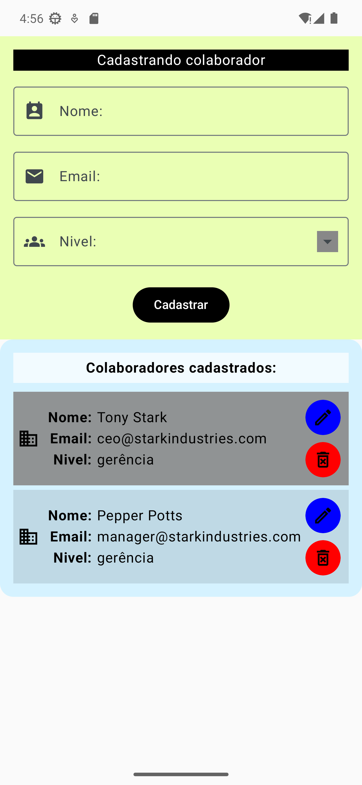
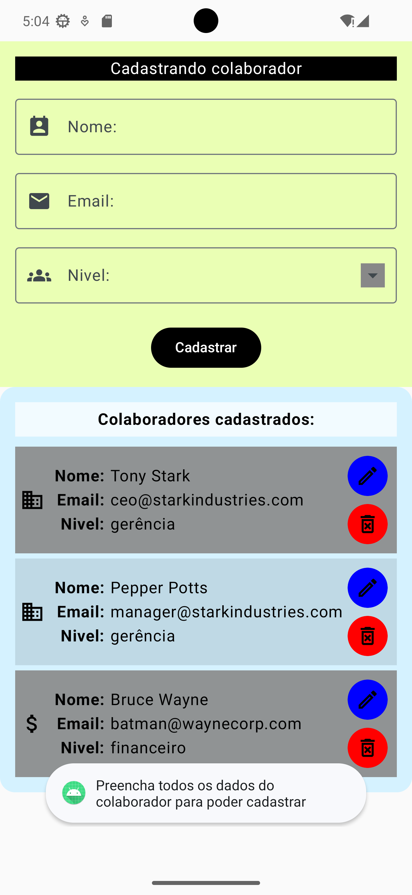
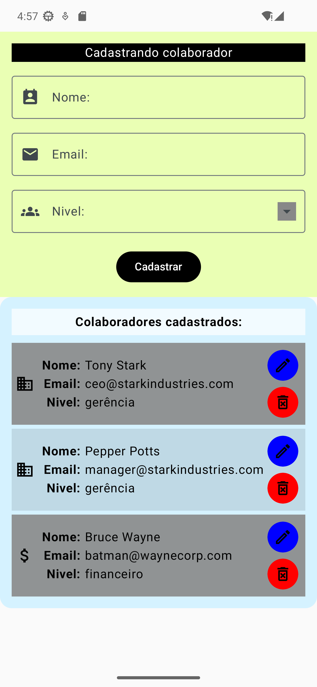
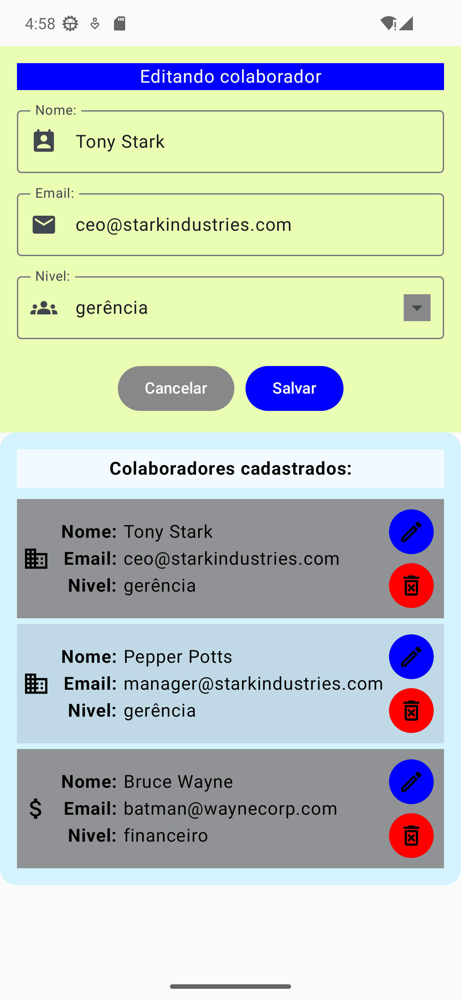
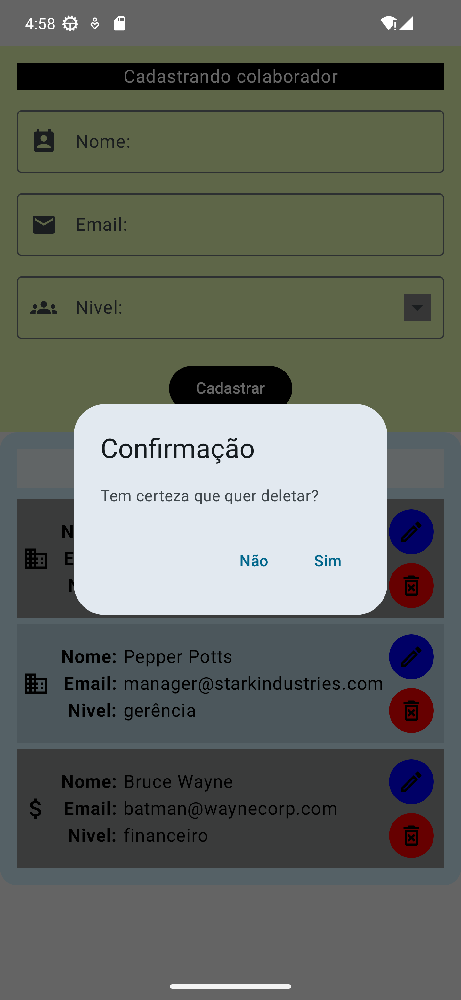

# Acompanhamento 01 - Jetpack Compose

## REQUERIMENTOS DO PROJETO

Criar um projeto CRUD para gerenciar colaboradores.

__Data de entrega:__ 01/07 às 10h.

__Enviar o link do repositório GitHub para:__ [contato@ralflima.com](mailto:contato@ralflima.com)

### Será possível efetuar as seguintes funcionalidades:

* __Cadastro:__ Nome, e-mail e nível (administrativo, financeiro, gerência e suporte);
* __Edição:__ Alterar nome, e-mail e nível;
* __Remoção:__ Remover colaboradores;
* __Cancelar:__ Para cancelar as ações de edição e remoção;
* __Listagem:__ Exibir todos os colaboradores cadastrados.

---

## Propósito do Projeto
Este projeto é uma aplicação Android desenvolvida com **Jetpack Compose** para o gerenciamento de colaboradores. Ele serve como uma ferramenta prática para demonstrar conceitos fundamentais de desenvolvimento Android moderno, incluindo gerenciamento de estado, componentes de UI personalizados, navegação e manipulação de coleções de dados.

## Funcionalidades Implementadas

### 1. Gerenciamento de Colaboradores (CRUD)
- **Cadastro**: Formulário intuitivo para registrar novos colaboradores com campos de Nome, Email e Nível.
- **Listagem**: Visualização em tempo real de todos os colaboradores cadastrados em uma lista elegante.
- **Edição**: Capacidade de atualizar os dados de um colaborador existente diretamente no formulário, com preenchimento automático.
- **Remoção**: Exclusão de registros da lista com um diálogo de confirmação para evitar ações acidentais.

### 2. Interface de Usuário (UI) Moderna
- **Design Elegante**: Uso de cores contrastantes e suaves (Verde Limão para o formulário e Azul Céu para a listagem).
- **Feedback Visual**: Ícones dinâmicos que representam o nível do colaborador (Gerência, Administrativo, Financeiro, Suporte).
- **Usabilidade**: Efeito de lista "zebrada" (listras alternadas) para facilitar a leitura e bordas arredondadas nos componentes.
- **Validação**: Verificação de campos vazios com mensagens de alerta (Toast) ao tentar cadastrar dados incompletos.

### 3. Lógica de Dados
- **Geração de IDs**: Sistema automático de geração de IDs únicos para cada colaborador.
- **Estado Reativo**: Utilização de `mutableStateListOf` e `remember` para garantir que a UI reflita instantaneamente as mudanças nos dados.

## Screenshots da Aplicação

### Estado Inicial

A tela inicial exibe o formulário de cadastro limpo e a lista com colaboradores pré-carregados.

### Validação de Dados

Ao tentar cadastrar sem preencher os campos, o sistema impede a ação e exibe um alerta visual.

### Cadastro Realizado

Após preencher os dados corretamente, o novo colaborador é adicionado instantaneamente à listagem.

### Modo de Edição

Ao clicar no ícone de edição, o formulário é preenchido com os dados do colaborador selecionado e muda para o modo "Salvar".

### Confirmação de Exclusão

Um diálogo de confirmação solicita o aval do usuário antes de remover definitivamente um registro.

---

Desenvolvido como parte do treinamento de Jetpack Compose.
